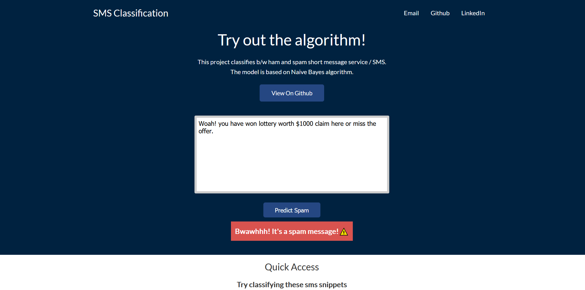
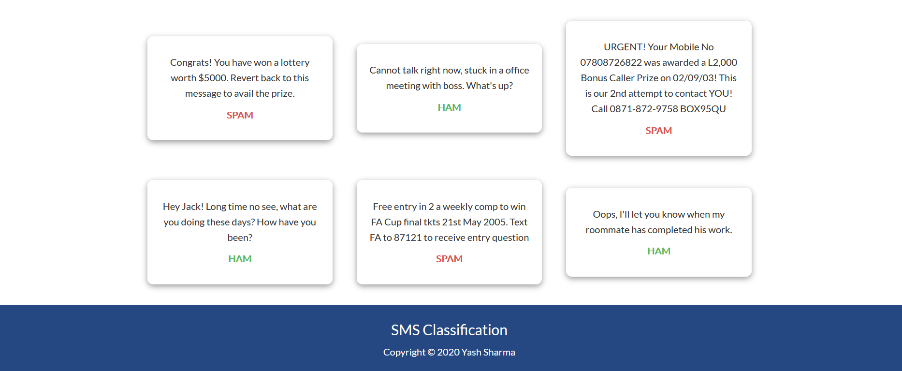
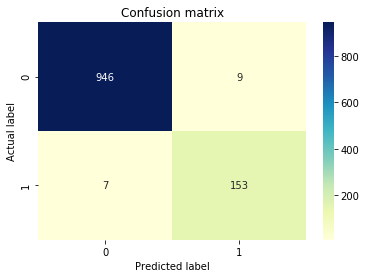

# SMS_Classification

This project classifies b/w ham and spam short message service / SMS.
The model is based on Naive Bayes algorithm. 

Link to woring project: https://sms-classifier-ml.herokuapp.com/

# Problem Statement

The objective of the dataset is to diagnostically classifly b/w spam and ham messages. The dataset for this problem statement can be found here https://archive.ics.uci.edu/ml/datasets/sms+spam+collection

# Tech Stack

| Target | Stack |
| ------ | ------ |
| Front end | HTML+CSS |
| Algorithm | Python |
| Server | Flask |


# Sneak Peek



# Results


The accuracy score for this model is 0.985. 


# Getting started
After cloning the repo you can run this command to fetch all requirements. Note that you need to have Python installed on your system.
```
pip install -r requirements.txt
```
